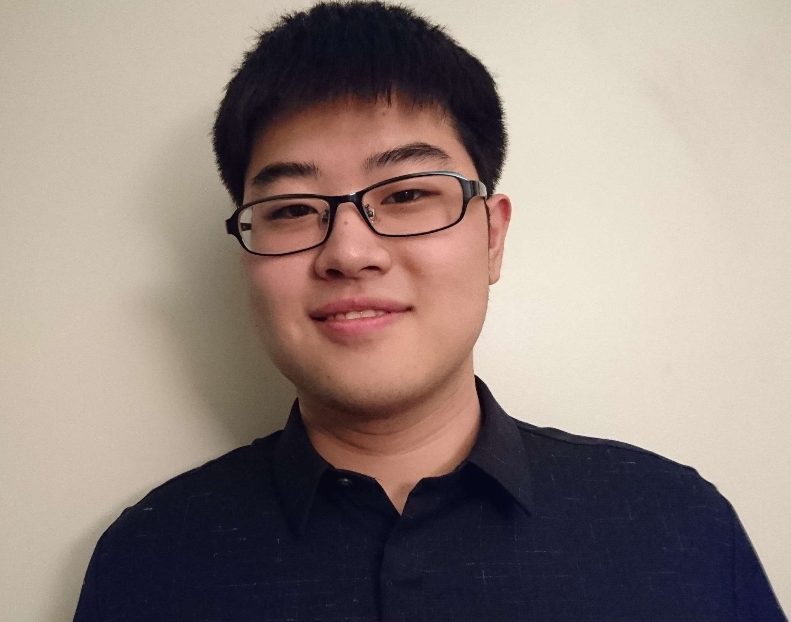

# Bjoern Cheng Yi's Home Page

## About Me

I'm a graduate student at George Washington University majoring computer science. My expected graduation date is May 2017.

I earned my Bachelor of Science degree in computer science in 2016.

Since May 2015, I have been working as a research assistant and conducting researches with Professor Evan Drumwright in the Positronics Lab at GWU. Our main goal for the research is to find an accurate way to simulate the dynamics of a multi-rigid-body system.

## Projects
### Repository I contribute to
* **Moby**: A 3-dimensional multi-rigid-body dynamic simulation library written in C++ [[GitHub Repository](https://github.com/PositronicsLab/Moby/)]

## Publications
* **Yi, B.** Drumwright, E. (2016), Determining Contact Data for Rigid Body Dynamics with Convex Polyhedral Geometries. 2016 IEEE International Conference on Simulation, Modeling, and Programming for Autonomous Robots, San Francisco, CA. December 13-16, 2016 (peer reviewed)[[pdf](http://positronicslab.github.io/assets/pdfs/CD16.pdf)]

## Work experience
* **Research Assistant**, The Positronics Lab, George Washington University, May 2015 – Present

	* Researching algorithms to correct interpenetration errors in multi-rigid- body simulations

	* Implemented the V-Clip Algorithm for contact determination in C++

* **Research Assistant**, The Positronics Lab, George Washington University, Nov. – Dec. 2014

	* Investigated the properties of two augmented reality (AR) tag tracking libraries on ROS toward door pose tracking with robots

## Skills
* **Math**: Linear Algebra, Analytic Geometry, Number Theory, Mathematical Proof

* **Robotics**: Feedback Control, Inverse and Forward Kinematics, Trajectory Formation

* **Algorithm Design &amp; Analysis**: Space and time complexity analysis

* **Source Control Software**: Git

* **Programing language**: C++, MATLAB, Java

* **Language**: English – Fluent, Chinese – Native, Japanese - Basic

<!-- -->
## Resume
An electronic copy of my resume can be retrieved [here](/document/resume.pdf)

<!-- -->
## Contact
Email: yicheng0922@gwmail.gwu.edu
